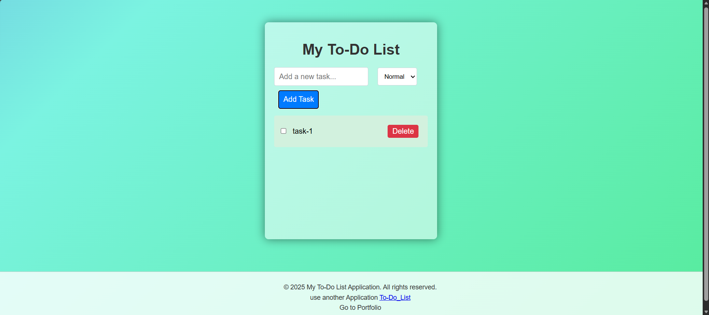

# To-Do List Web Application

A simple and interactive To-Do List project built with HTML, CSS, and JavaScript.

This workspace includes two versions of the app:
- `index.html` + `styles.css` + `script.js`
- `index2.html` + `styles2.css` + `script2.js`

## Demo Preview

The file `image.png` shows a demo of how the website looks.

## Features

### Version 1 (`index.html`)
- Add tasks with priority levels (`Normal`, `High`, `Low`)
- Mark tasks as completed
- Delete tasks
- Drag and reorder tasks
- Local storage support (tasks are saved in the browser)

### Version 2 (`index2.html`)
- Add tasks with priority levels
- Add opening and closing time for each task
- Automatic duration calculation from time range
- Delete tasks
- Local storage support

## Project Structure

- `index.html`: Main To-Do page (version 1)
- `styles.css`: Styling for version 1
- `script.js`: Logic for version 1
- `index2.html`: Alternate To-Do page (version 2)
- `styles2.css`: Styling for version 2
- `script2.js`: Logic for version 2
- `image.png`: Demo screenshot of the website UI

## How To Run

1. Open the project folder.
2. Open `index.html` in your browser (or `index2.html` for version 2).
3. Start adding tasks.

## Notes

- Data is stored in browser local storage.
- Clearing browser data/local storage will remove saved tasks.
